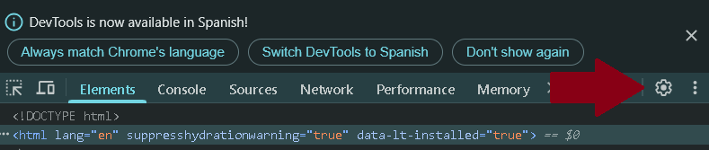
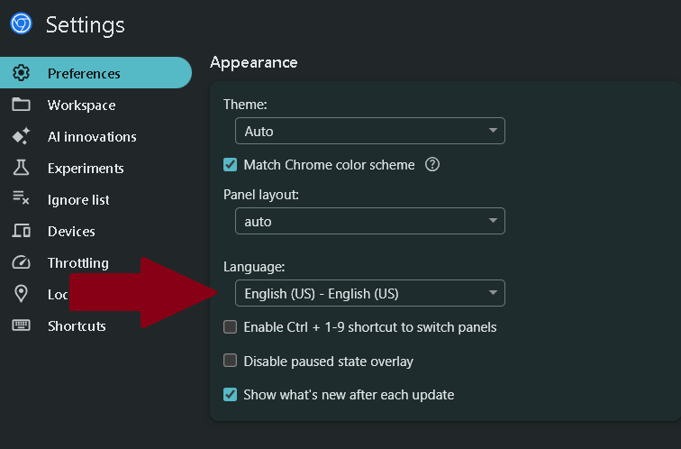
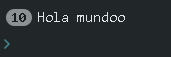
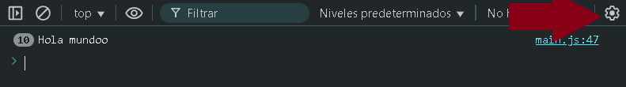
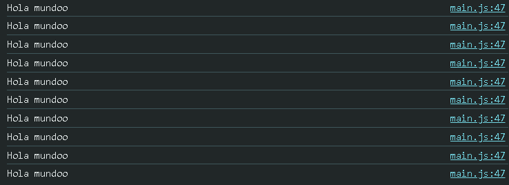
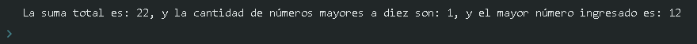

# Ejercicios 1.

En todos los ejercicios, los datos deben ser ingresados por el usuario mediante la función `prompt()`.
<hr>

1. Escribe un programa que le pida al usuario ingresar una frase y la imprima en la consola. 

*Recuerda que para pedirle al usuario que escriba una frase debes utilizar el método `prompt()` y para escribir en la consola debes utilizar el método `console.log()`.*

<br>
<br>
<hr>

2. Escribe un programa que le pregunte al usuario su nombre e imprima "Hola " seguido del nombre y un signo de exclamación.

*Por ejemplo, si el usuario ingresa "Pedro" el programa debe imprimir en la consola "Hola Pedro!".*

<br>
<br>
<hr>

3. Escribe un programa que le pida al usuario ingresar un número, luego le pide un segundo número, e imprima en la consola la suma de los dos números que ingresó el usuario.

*Recuerde que los datos ingresados con la función `prompt` son de tipo `string`, por lo que es necesario parsearlos a valores numéricos*.

<br>
<br>
<hr>

4. Escribe un programa que le pida un número al usuario e imprima en la consola si el número si es mayor, menor o igual que 10.

*Si el número es menor a 10 debe imprimir `El número es menor que 10`.*

*Si el número es mayor a 10 debe imprimir `El número es mayor que 10`.*

*Si el número es igual a 10 debe imprimir `El número es igual a 10`.*

<br>
<br>
<hr>

5. Escribe un programa que le pida al usuario ingresar una frase. El programa debe imprimir la frase en la consola 10 veces. (Utiliza la estructura de repetición `for`).

<br>
<br>

*Ayuda con consola:*  **(opcional)**
- Configurar la consola en español en el caso de que esté en inglés.
> Haz clic derecho en el navegador y selecciona la opción `Inspeccionar`.

> Haz clic en el icono de engranaje o presiona la tecla `F1` para acceder a la configuración.



<br>

> En la seccion `Language`, desplegaremos el menú y seleccionaremos **Spanish**.



Una vez seleccionado, cerraremos la consola y la abriremos nuevamente para verificar que los cambios se hayan aplicado correctamente.

*En esta instancia, configuraremos la consola en español, pero es recomendable que el estudiante practique su inglés, ya que esto le ayudará a mejorar sus habilidades en programación*.

- En este ejercicio, es probable que la consola haya mostrado la frase de la siguiente manera:



Para visualizar cada iteración de la estructura de repetición, debemos acceder al engranaje en la sección `Ajustes de Consola`, ya que no cuenta con una tecla de acceso rápido.



A continuación, debemos desmarcar el checkbox de `Agrupar mensajes similares en la consola`.



<br>
<br>
<hr>

6. Escribe un programa para la consola que le pida al usuario un número e imprima los números desde 1 hasta el número. (Utiliza la estructura de repetición `for`).

    *Por ejemplo, si el usuario ingresa el número 5, el programa de be imprimir:*
```Markdown
1
2
3
4
5
```

<br>
<br>
<hr>

7. Realice el código que permita ingresar 10 números enteros y determine la suma total de los mismos, el número mayor ingresado y la cantidad de valores que sean mayores a diez. En la consola se debe mostrar de la siguiente manera:



<br>
<br>
<hr>

8. Escribe un programa para la consola que le pida al usuario dos números e imprima en la consola los números en ese rango. Por ejemplo, si el usuario ingresa 5 como primer número y 10 como segundo número, el programa debe imprimir:

- El programa debe funcionar sin importar el orden en que el usuario ingrese los números, ya sea que introduzca primero el mayor o el menor.

*Ejemplo de salida en consola:*

```Markdown
5
6
7
8
9
10
```
<br>
<br>
<hr>

9. Realice el código que permita ingresar letras hasta que se ingrese la letra 'z'. El programa debe contar la cantidad total de letras ingresadas y la cantidad de vocales.

<br>
<br>
<hr>
